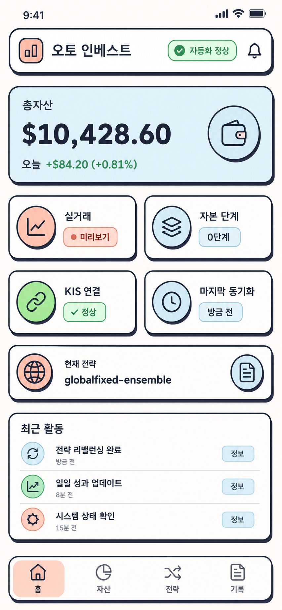

# 디자인 시스템: Friendly Clay Finance

위 이미지는 선택한 `Claymorphism + Vibrant & Block-based` 방향을 확인하기 위한 개념
시안이다. 시안 속 자산·수익 숫자는 예시일 뿐이며 첫 앱에는 사용하지 않는다. 실제 앱의 같은
자리에는 공개 상태 자료에 있는 전체 운영 상태, 돈 경로, 다음 행동과 신선도만 표시한다.

## 원칙

- 친근한 인상은 둥근 블록, 단단한 윤곽, 짧은 그림자로 만든다.
- 금융 상태는 장식보다 먼저 읽혀야 하며 색상 하나만으로 의미를 전달하지 않는다.
- 긴 설명보다 판정, 이유, 다음 행동, 기준 시각 순서로 보여준다.
- 앱은 읽기 전용임을 숨기지 않고 홈과 설명 화면에 명시한다.

## 색상 토큰

| 역할 | 값 | 사용 |
|---|---|---|
| `canvas` | `#FFF9F5` | 전체 배경 |
| `surface` | `#FFFFFF` | 기본 카드 |
| `ink` | `#30394B` | 본문, 윤곽, 그림자 |
| `coral` | `#FDBCB4` | 행동 필요, 강조 카드 |
| `sky` | `#ADD8E6` | 정보, 보조 카드 |
| `success` | `#22C55E` | 확인된 정상 |
| `warning` | `#B45309` | 지연, 주의 |
| `danger` | `#B91C1C` | 위험, 확인 불가 |
| `muted` | `#667085` | 보조 설명 |

배경과 본문의 기본 조합은 `canvas`/`ink`이며, 상태색 위에도 충분한 대비가 나도록 짙은
`ink` 또는 흰색을 선택한다. 밝은 초록은 넓은 본문 배경보다 배지와 진행 표시 중심으로 쓴다.

## 형태와 간격

- 카드 모서리: 20 논리 픽셀
- 버튼·배지 모서리: 14 논리 픽셀 또는 완전한 알약 형태
- 윤곽: `ink` 2 논리 픽셀
- 그림자: `ink`를 아래 5, 오른쪽 5 논리 픽셀로 이동한 단단한 그림자
- 화면 좌우 여백: 20 논리 픽셀
- 카드 안쪽 여백: 16~20 논리 픽셀
- 항목 간격: 8, 12, 16, 24 논리 픽셀 체계
- 모든 핵심 터치 영역: 최소 44×44 논리 픽셀

## 글자 역할

원격 글꼴을 내려받지 않고 운영체제 기본 글꼴을 사용한다. 한글 깨짐과 오프라인 첫 실행을
피하기 위해서다.

| 역할 | 기준 |
|---|---|
| 큰 판정 | 28~32, 굵게, 최대 두 줄 |
| 화면 제목 | 24, 굵게 |
| 카드 제목 | 17~18, 굵게 |
| 본문 | 15~16, 보통 |
| 보조 정보 | 13~14, 보통 |
| 상태 배지 | 12~13, 굵게 |

## 공통 구성요소

- `ClayCard`: 윤곽과 오프셋 그림자를 가진 기본 블록.
- `StatusPill`: 아이콘, 한글 상태 문구, 색상을 함께 가진 배지.
- `FreshnessBanner`: 온라인·오프라인·지연·확인 불가와 생성 시각을 고정 표시.
- `SummaryBlock`: 아이콘, 짧은 제목, 판정, 한 줄 설명으로 된 핵심 요약.
- `AutomationTile`: 중요도, 상태, 마지막 실행, 허용 신선도와 설명을 표시.
- `EvidenceLink`: 44픽셀 이상 읽기 전용 외부 기록 버튼.
- `EmptyState`: 값을 추측하지 않고 무엇을 확인할 수 없는지와 다시 시도 방법을 설명.

## 상태 표현

정상은 체크, 주의·지연은 느낌표, 행동 필요는 깃발, 위험은 삼각 경고, 누락·확인 불가는
물음표 아이콘을 쓴다. 모든 아이콘 옆에 한글 상태 문구를 붙인다. 알 수 없는 원문 상태값은
숨기지 않고 상세 설명에 함께 표시한다.

## 움직임

새로고침과 화면 전환에만 짧은 기본 움직임을 사용한다. 가격·상태를 반복해서 깜빡이거나
맥박처럼 움직이게 하지 않는다. 기기의 움직임 줄이기 설정을 존중한다.
